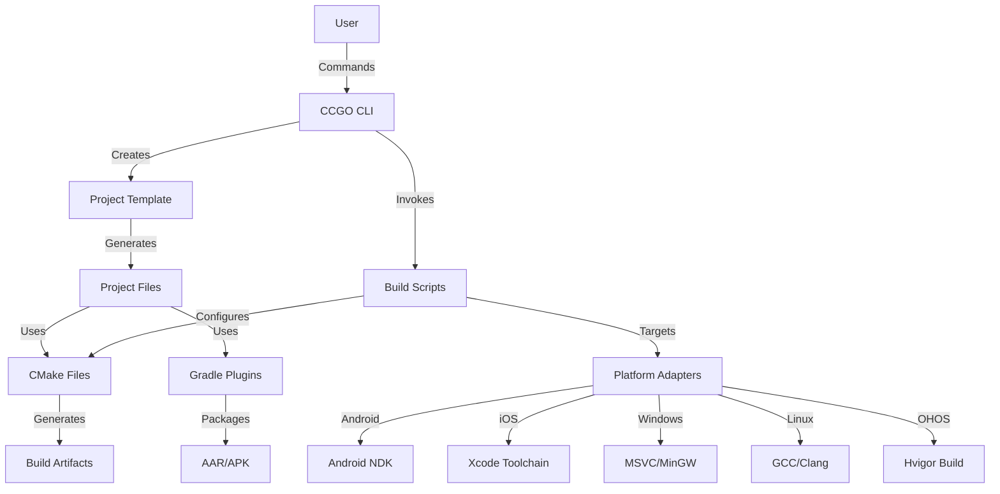

# CCGO Architecture

Comprehensive overview of CCGO's architectural design, components, and implementation details.

## Overview

CCGO is designed as a modular, extensible cross-platform build system composed of four main components:

```
CCGO Ecosystem
├── ccgo (Python/Rust CLI)      # Command-line interface and build orchestration
├── ccgo-template                # Copier-based project templates
├── ccgo-gradle-plugins          # Gradle convention plugins
└── ccgo-now (Example)           # Reference implementation
```

## System Architecture

### High-Level Architecture

```
┌─────────────────────────────────────────────────────────────┐
│                        User Interface                        │
│  ┌──────────┐  ┌──────────┐  ┌──────────┐  ┌─────────────┐ │
│  │ CLI Tool │  │ Template │  │  Gradle  │  │ IDE Support │ │
│  │  (ccgo)  │  │ Generator│  │ Plugins  │  │  (VS/Xcode) │ │
│  └─────┬────┘  └────┬─────┘  └────┬─────┘  └──────┬──────┘ │
└────────┼────────────┼─────────────┼────────────────┼────────┘
         │            │             │                │
┌────────┼────────────┼─────────────┼────────────────┼────────┐
│        │       Core Services      │                │        │
│  ┌─────▼────┐  ┌───▼────┐  ┌────▼────┐  ┌────────▼──────┐ │
│  │ Command  │  │Project │  │  Build  │  │   Platform    │ │
│  │ Dispatch │  │  Gen   │  │ Orchestr│  │   Adapters    │ │
│  └─────┬────┘  └───┬────┘  └────┬────┘  └────────┬──────┘ │
└────────┼───────────┼────────────┼─────────────────┼────────┘
         │           │            │                 │
┌────────┼───────────┼────────────┼─────────────────┼────────┐
│        │      Build Backend     │                 │        │
│  ┌─────▼────┐  ┌──▼─────┐  ┌───▼────┐  ┌────────▼──────┐ │
│  │  CMake   │  │ Copier │  │Platform│  │   Toolchains  │ │
│  │Templates │  │  Jinja │  │Scripts │  │ (NDK/Xcode/VS)│ │
│  └──────────┘  └────────┘  └────────┘  └───────────────┘ │
└─────────────────────────────────────────────────────────────┘
```

### Component Interaction



## CCGO CLI Architecture

### Command Pattern

```python
# CLI Structure (Python)
ccgo/
├── main.py                    # Entry point
├── cli.py                     # Root command parser
├── commands/                  # Command modules
│   ├── __init__.py
│   ├── new.py                # Project creation
│   ├── init.py               # Project initialization
│   ├── build.py              # Build orchestration
│   ├── test.py               # Test execution
│   ├── bench.py              # Benchmarking
│   ├── doc.py                # Documentation
│   ├── publish.py            # Publishing
│   ├── check.py              # Environment check
│   ├── clean.py              # Cleanup
│   ├── tag.py                # Git tagging
│   ├── package.py            # Packaging
│   ├── install.py            # Dependency installation
│   └── help.py               # Help system
├── build_scripts/            # Platform build scripts
│   ├── build_android.py
│   ├── build_ios.py
│   ├── build_macos.py
│   ├── build_windows.py
│   ├── build_linux.py
│   ├── build_ohos.py
│   ├── build_tvos.py
│   ├── build_watchos.py
│   ├── build_kmp.py
│   ├── build_conan.py
│   ├── build_utils.py
│   ├── dependency_manager.py
│   └── cmake/                # CMake templates
└── utils/                    # Utilities
    ├── context/              # CLI context
    └── cmd/                  # Command execution
```

### Rust CLI Architecture (New)

```rust
// CLI Structure (Rust)
ccgo-rs/
├── src/
│   ├── main.rs               # Entry point
│   ├── cli.rs                # CLI definition (clap)
│   ├── commands/             # Command implementations
│   │   ├── mod.rs
│   │   ├── new.rs
│   │   ├── build.rs
│   │   ├── test.rs
│   │   ├── publish.rs
│   │   └── ...
│   ├── config/               # Configuration
│   │   ├── mod.rs
│   │   └── ccgo_toml.rs
│   ├── exec/                 # Process execution
│   │   ├── mod.rs
│   │   ├── subprocess.rs
│   │   └── python.rs
│   └── utils/                # Utilities
│       ├── mod.rs
│       ├── paths.rs
│       ├── terminal.rs
│       └── git_version.rs
└── Cargo.toml
```

### Command Execution Flow

```
1. User Input
   └─> ccgo build android --arch arm64-v8a

2. CLI Parsing (cli.py / cli.rs)
   └─> Route to commands/build.py::Build class

3. Command Execution (build.py)
   ├─> Parse arguments
   ├─> Load build_config.py from project
   ├─> Import build_scripts/build_android.py
   └─> Execute build_android.main()

4. Platform Build Script (build_android.py)
   ├─> Validate environment (NDK, SDK)
   ├─> Configure CMake with toolchain
   ├─> Generate CMakeLists.txt from templates
   ├─> Execute CMake configuration
   ├─> Execute CMake build
   └─> Package artifacts (SO, AAR)

5. Output
   └─> target/android/arm64-v8a/libproject.so
       target/android/project.aar
```

## Template Architecture

### Copier Integration

```
ccgo-template/
├── copier.yml                # Template configuration
├── copier_extensions.py      # Jinja2 extensions
└── template/                 # Template files
    └── {{cpy_project_relative_path}}/
        ├── CCGO.toml.jinja   # Project config
        ├── CMakeLists.txt.jinja
        ├── build.py.jinja
        ├── build_config.py.jinja
        └── src/
            └── {{cpy_project_name}}.cpp.jinja
```

### Template Variables

```yaml
# copier.yml
project_name:
  type: str
  help: Project name (lowercase, no spaces)

project_description:
  type: str
  help: Brief project description

project_license:
  type: str
  choices:
    - MIT
    - Apache-2.0
    - GPL-3.0
  default: MIT

target_platforms:
  type: str
  choices:
    - All
    - Mobile (Android + iOS)
    - Desktop (macOS + Windows + Linux)
  default: All
```

### Jinja2 Extensions

```python
# copier_extensions.py

class GitExtension(StandaloneTag):
    def get_current_branch(self):
        return subprocess.check_output(
            ["git", "branch", "--show-current"]
        ).decode().strip()

class SlugifyExtension(Extension):
    def slug(self, text):
        return text.lower().replace(" ", "-")

class CurrentYearExtension(Extension):
    def year(self):
        return datetime.now().year
```

## Build System Architecture

### CMake Layer

```
Build Process Flow
┌─────────────────────────────────────────────────────┐
│ 1. Configuration Phase                              │
│    ├─> Read CCGO.toml                              │
│    ├─> Detect platform                             │
│    ├─> Set CCGO_CMAKE_DIR environment variable     │
│    └─> Pass to CMake                               │
└──────────────────┬──────────────────────────────────┘
                   │
┌──────────────────▼──────────────────────────────────┐
│ 2. CMake Configuration                              │
│    ├─> Include CCGO CMake utilities                │
│    ├─> Apply platform toolchain                    │
│    ├─> Configure compiler flags                    │
│    ├─> Resolve dependencies                        │
│    └─> Generate build files                        │
└──────────────────┬──────────────────────────────────┘
                   │
┌──────────────────▼──────────────────────────────────┐
│ 3. Build Phase                                      │
│    ├─> Compile source files                        │
│    ├─> Link libraries                              │
│    ├─> Apply platform-specific settings            │
│    └─> Generate artifacts                          │
└──────────────────┬──────────────────────────────────┘
                   │
┌──────────────────▼──────────────────────────────────┐
│ 4. Packaging Phase                                  │
│    ├─> Collect artifacts                           │
│    ├─> Strip symbols (if release)                  │
│    ├─> Create archives (ZIP)                       │
│    └─> Generate build metadata (JSON)              │
└─────────────────────────────────────────────────────┘
```

### Platform Adapters

Each platform has a dedicated build script:

```python
# build_android.py
class AndroidBuilder:
    def __init__(self, config):
        self.config = config
        self.ndk_path = self._find_ndk()
        self.sdk_path = self._find_sdk()

    def configure(self):
        """Configure CMake with Android toolchain"""
        toolchain = os.path.join(
            self.ndk_path,
            "build/cmake/android.toolchain.cmake"
        )
        cmake_args = [
            f"-DCMAKE_TOOLCHAIN_FILE={toolchain}",
            f"-DANDROID_ABI={self.config.arch}",
            f"-DANDROID_PLATFORM=android-{self.config.min_sdk}",
            f"-DCCGO_CMAKE_DIR={self.ccgo_cmake_dir}",
        ]
        return cmake_args

    def build(self):
        """Execute CMake build"""
        # Generate build files
        run_cmd(["cmake", *self.configure(), ".."])

        # Build
        run_cmd(["cmake", "--build", ".", "--config", "Release"])

    def package(self):
        """Package AAR and SO files"""
        # Collect SO files
        # Generate AAR
        # Create archives
```

### Dependency Management

```python
# dependency_manager.py
class DependencyManager:
    def __init__(self, project_dir):
        self.ccgo_toml = self._load_ccgo_toml(project_dir)
        self.dependencies = self.ccgo_toml.get("dependencies", {})

    def resolve(self, platform):
        """Resolve dependencies for platform"""
        resolved = []

        for name, spec in self.dependencies.items():
            dep = self._resolve_single(name, spec, platform)
            resolved.append(dep)

        return resolved

    def _resolve_single(self, name, spec, platform):
        """Resolve single dependency"""
        if "git" in spec:
            return self._resolve_git(name, spec)
        elif "path" in spec:
            return self._resolve_path(name, spec)
        elif "version" in spec:
            return self._resolve_version(name, spec, platform)
```

## Gradle Plugin Architecture

### Plugin Hierarchy

```kotlin
// Convention plugins structure
com.mojeter.ccgo.gradle.android
├── .library                   # Base library plugin
│   ├── .native
│   │   ├── .python           # Python-based builds
│   │   └── .cmake            # CMake-based builds
│   └── (base configuration)
├── .application               # Base application plugin
│   ├── .native
│   │   ├── .python
│   │   └── .cmake
│   └── (base configuration)
├── .feature                   # Feature module plugin
└── .publish                   # Publishing plugin
```

### Plugin Application Chain

```
User applies: android.library.native.python
    │
    ├─> Applies: android.library (base)
    │       │
    │       ├─> Applies: com.android.library
    │       ├─> Applies: org.jetbrains.kotlin.android
    │       └─> Configures: Standard Android settings
    │
    └─> Adds: CCGO native build support
            │
            ├─> Creates: ccgoNative extension
            ├─> Registers: buildCcgoNative task
            ├─> Registers: cleanCcgoNative task
            └─> Hooks: Pre-build dependency
```

### Native Build Integration

```kotlin
// Plugin implementation
class CcgoNativePlugin : Plugin<Project> {
    override fun apply(project: Project) {
        // Create extension
        val extension = project.extensions.create(
            "ccgoNative",
            CcgoNativeExtension::class.java
        )

        // Register build task
        project.tasks.register(
            "buildCcgoNative",
            CcgoNativeBuildTask::class.java
        ) { task ->
            task.projectDir.set(extension.projectDir)
            task.architectures.set(extension.architectures)
            task.buildType.set(extension.buildType)
        }

        // Hook into Android build
        project.afterEvaluate {
            project.tasks.named("preBuild") {
                dependsOn("buildCcgoNative")
            }
        }
    }
}
```

## Docker Architecture

### Multi-Stage Builds

```dockerfile
# Dockerfile.android (example)
FROM ubuntu:22.04 as base
RUN apt-get update && apt-get install -y \
    build-essential cmake ninja-build

FROM base as android-deps
# Install Android SDK/NDK
RUN wget https://dl.google.com/android/repository/...

FROM android-deps as builder
# Build environment
WORKDIR /workspace
COPY . .
RUN ccgo build android --arch arm64-v8a,x86_64

FROM scratch as output
# Extract artifacts
COPY --from=builder /workspace/target/android /output
```

### Build Orchestration

```python
# build_docker.py
class DockerBuilder:
    def __init__(self, platform, config):
        self.platform = platform
        self.config = config
        self.image_name = f"ccgo-builder-{platform}"

    def build_image(self):
        """Build or pull Docker image"""
        if self._image_exists():
            return

        dockerfile = self._get_dockerfile()
        run_cmd([
            "docker", "build",
            "-f", dockerfile,
            "-t", self.image_name,
            "."
        ])

    def build_in_container(self):
        """Execute build inside container"""
        run_cmd([
            "docker", "run",
            "--rm",
            "-v", f"{self.project_dir}:/workspace",
            "-w", "/workspace",
            self.image_name,
            "ccgo", "build", self.platform,
            *self.config.extra_args
        ])
```

## Version Management Architecture

### Version Injection Pipeline

```
CCGO.toml (version = "1.2.3")
    │
    ├─> Read by build script
    │       │
    │       ├─> Parse semantic version
    │       ├─> Get git information
    │       │   ├─> Commit SHA
    │       │   ├─> Branch name
    │       │   └─> Dirty status
    │       └─> Generate version header
    │               │
    │               ├─> version.h (C++)
    │               ├─> build_info.json (metadata)
    │               └─> Platform-specific
    │                   ├─> Android: version_code
    │                   ├─> iOS: build_number
    │                   └─> Windows: file_version
    │
    └─> CMake configuration
            │
            ├─> Set PROJECT_VERSION
            ├─> Set GIT_SHA
            ├─> Set GIT_BRANCH
            └─> configure_file(version.h.in)
```

### Archive Structure

```
Unified Archive Format
{PROJECT}_{PLATFORM}_SDK-{VERSION}.zip
├── lib/
│   ├── static/
│   │   └── {arch}/              # Static libraries
│   └── shared/
│       └── {arch}/              # Dynamic libraries
├── frameworks/                  # Apple platforms
│   ├── static/
│   └── shared/
├── haars/                       # Android/OHOS packages
├── include/                     # Public headers
└── build_info.json              # Build metadata

{PROJECT}_{PLATFORM}_SDK-{VERSION}-SYMBOLS.zip
├── symbols/
│   ├── static/                  # dSYM, PDB for static
│   └── shared/                  # dSYM, PDB for shared
└── obj/                         # Unstripped libraries
```

## Extension Points

### Custom Commands

```python
# ccgo/commands/custom.py
from utils.context import CliCommand

class Custom(CliCommand):
    @staticmethod
    def description():
        return "Custom command description"

    @staticmethod
    def cli():
        parser = argparse.ArgumentParser()
        parser.add_argument("--option", help="Custom option")
        return parser

    @staticmethod
    def exec(context, args):
        # Custom command implementation
        print(f"Executing custom command with {args.option}")
        return CliResult.success()
```

### Custom Platforms

```python
# build_scripts/build_custom.py
def main(build_config):
    """Custom platform build script"""

    # Configuration
    cmake_args = [
        "-DCMAKE_SYSTEM_NAME=Custom",
        "-DCMAKE_C_COMPILER=custom-gcc",
        "-DCMAKE_CXX_COMPILER=custom-g++",
    ]

    # Build
    run_cmake_build(build_config, cmake_args)

    # Package
    package_artifacts(build_config)
```

### Custom Templates

```yaml
# copier.yml extensions
_jinja_extensions:
  - copier_templates.GitExtension
  - my_extensions.CustomExtension

custom_config:
  type: str
  when: "{{ project_type == 'custom' }}"
  help: Custom configuration option
```

## Performance Considerations

### Build Caching

```python
# Incremental builds
class BuildCache:
    def __init__(self, cache_dir):
        self.cache_dir = cache_dir
        self.manifest = self._load_manifest()

    def is_cached(self, source_files):
        """Check if build is cached"""
        current_hash = self._compute_hash(source_files)
        cached_hash = self.manifest.get("hash")
        return current_hash == cached_hash

    def save(self, source_files, artifacts):
        """Save build to cache"""
        self.manifest["hash"] = self._compute_hash(source_files)
        self.manifest["artifacts"] = artifacts
        self._save_manifest()
```

### Parallel Builds

```python
# Multi-threaded CMake builds
def build_all_architectures(architectures):
    with ThreadPoolExecutor(max_workers=len(architectures)) as executor:
        futures = []
        for arch in architectures:
            future = executor.submit(build_architecture, arch)
            futures.append(future)

        for future in as_completed(futures):
            result = future.result()
            print(f"Build completed: {result}")
```

## Testing Architecture

### Unit Tests

```python
# tests/test_build_android.py
import unittest
from build_scripts.build_android import AndroidBuilder

class TestAndroidBuilder(unittest.TestCase):
    def test_configure(self):
        builder = AndroidBuilder(mock_config)
        args = builder.configure()
        self.assertIn("-DANDROID_ABI=arm64-v8a", args)

    def test_ndk_detection(self):
        builder = AndroidBuilder(mock_config)
        ndk_path = builder._find_ndk()
        self.assertTrue(os.path.exists(ndk_path))
```

### Integration Tests

```bash
# tests/integration/test_build_workflow.sh
#!/bin/bash

# Create test project
ccgo new test-project --defaults
cd test-project/test-project

# Build for Android
ccgo build android --arch arm64-v8a

# Verify output
test -f target/android/arm64-v8a/libtest-project.so

# Clean up
cd ../..
rm -rf test-project
```

## Resources

### Architecture Documentation

- [CLI Design Patterns](https://clig.dev/)
- [CMake Best Practices](https://cmake.org/cmake/help/latest/guide/user-interaction/index.html)
- [Gradle Plugin Development](https://docs.gradle.org/current/userguide/custom_plugins.html)

### CCGO Documentation

- [CLI Reference](../reference/cli.md)
- [Build System](../features/build-system.md)
- [CMake Integration](../reference/cmake.md)
- [Gradle Plugins](../reference/gradle-plugins.md)

### Community

- [GitHub Discussions](https://github.com/zhlinh/ccgo/discussions)
- [Issue Tracker](https://github.com/zhlinh/ccgo/issues)
- [Contributing Guide](contributing.md)

## Next Steps

- [Contributing Guide](contributing.md)
- [Changelog](changelog.md)
- [Development Roadmap](roadmap.md)
