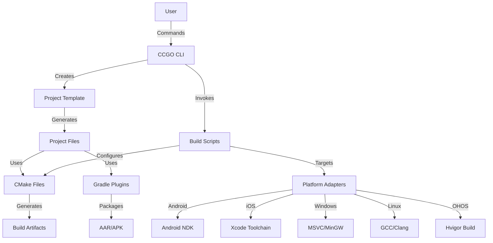

# CCGO Architecture

Comprehensive overview of CCGO's architectural design, components, and implementation details.

## Overview

CCGO is designed as a modular, extensible cross-platform build system composed of four main components:

```
CCGO Ecosystem
├── ccgo (Rust CLI)              # Command-line interface and build orchestration
├── ccgo-template                # Copier-based project templates
├── ccgo-gradle-plugins          # Gradle convention plugins
└── ccgo-now (Example)           # Reference implementation
```

## System Architecture

### High-Level Architecture

```
┌─────────────────────────────────────────────────────────────┐
│                        User Interface                        │
│  ┌──────────┐  ┌──────────┐  ┌──────────┐  ┌─────────────┐ │
│  │ CLI Tool │  │ Template │  │  Gradle  │  │ IDE Support │ │
│  │  (ccgo)  │  │ Generator│  │ Plugins  │  │  (VS/Xcode) │ │
│  └─────┬────┘  └────┬─────┘  └────┬─────┘  └──────┬──────┘ │
└────────┼────────────┼─────────────┼────────────────┼────────┘
         │            │             │                │
┌────────┼────────────┼─────────────┼────────────────┼────────┐
│        │       Core Services      │                │        │
│  ┌─────▼────┐  ┌───▼────┐  ┌────▼────┐  ┌────────▼──────┐ │
│  │ Command  │  │Project │  │  Build  │  │   Platform    │ │
│  │ Dispatch │  │  Gen   │  │ Orchestr│  │   Adapters    │ │
│  └─────┬────┘  └───┬────┘  └────┬────┘  └────────┬──────┘ │
└────────┼───────────┼────────────┼─────────────────┼────────┘
         │           │            │                 │
┌────────┼───────────┼────────────┼─────────────────┼────────┐
│        │      Build Backend     │                 │        │
│  ┌─────▼────┐  ┌──▼─────┐  ┌───▼────┐  ┌────────▼──────┐ │
│  │  CMake   │  │ Copier │  │Platform│  │   Toolchains  │ │
│  │Templates │  │  Jinja │  │Scripts │  │ (NDK/Xcode/VS)│ │
│  └──────────┘  └────────┘  └────────┘  └───────────────┘ │
└─────────────────────────────────────────────────────────────┘
```

### Component Interaction



## CCGO CLI Architecture

### Command Pattern

The CCGO CLI is built in Rust using the `clap` crate for command-line parsing. It follows a modular command pattern:

```rust
// CLI Structure (Rust)
src/
├── main.rs                   # Entry point
├── cli.rs                    # CLI definition (clap derive)
├── commands/                 # Command implementations
│   ├── mod.rs               # Command module exports
│   ├── new.rs               # Project creation (ccgo new)
│   ├── init.rs              # Project initialization (ccgo init)
│   ├── build.rs             # Build orchestration (ccgo build)
│   ├── test.rs              # Test execution (ccgo test)
│   ├── bench.rs             # Benchmarking (ccgo bench)
│   ├── doc.rs               # Documentation (ccgo doc)
│   ├── publish.rs           # Publishing (ccgo publish)
│   ├── check.rs             # Environment check (ccgo check)
│   ├── clean.rs             # Cleanup (ccgo clean)
│   ├── tag.rs               # Git tagging (ccgo tag)
│   ├── package.rs           # Packaging (ccgo package)
│   ├── install.rs           # Dependency installation (ccgo install)
│   ├── add.rs               # Add dependency (ccgo add)
│   ├── remove.rs            # Remove dependency (ccgo remove)
│   ├── tree.rs              # Dependency tree (ccgo tree)
│   ├── search.rs            # Package search (ccgo search)
│   ├── registry.rs          # Registry management (ccgo registry)
│   ├── update.rs            # Update dependencies (ccgo update)
│   ├── vendor.rs            # Vendor dependencies (ccgo vendor)
│   ├── run.rs               # Run examples (ccgo run)
│   └── analytics.rs         # Build analytics (ccgo analytics)
├── config/                   # Configuration parsing
│   ├── mod.rs               # Config module exports
│   └── ccgo_toml.rs         # CCGO.toml parsing
├── builders/                 # Platform builders
│   ├── mod.rs               # Builder traits and common code
│   ├── android.rs           # Android builder
│   ├── ios.rs               # iOS builder
│   ├── macos.rs             # macOS builder
│   ├── windows.rs           # Windows builder
│   ├── linux.rs             # Linux builder
│   ├── ohos.rs              # OpenHarmony builder
│   ├── tvos.rs              # tvOS builder
│   ├── watchos.rs           # watchOS builder
│   └── kmp.rs               # Kotlin Multiplatform builder
├── registry/                 # Package registry
│   ├── mod.rs               # Registry module exports
│   ├── index.rs             # Index parsing and caching
│   ├── resolver.rs          # Version resolution
│   └── graph.rs             # Dependency graph
├── exec/                     # Process execution
│   ├── mod.rs               # Execution utilities
│   └── subprocess.rs        # Subprocess management
└── utils/                    # Utilities
    ├── mod.rs               # Utility exports
    ├── paths.rs             # Path utilities
    ├── terminal.rs          # Terminal output (colors, progress)
    ├── git.rs               # Git operations
    └── cmake.rs             # CMake integration
```

### Command Execution Flow

```
1. User Input
   └─> ccgo build android --arch arm64-v8a

2. CLI Parsing (cli.rs with clap)
   └─> Match Commands::Build variant
   └─> Dispatch to commands/build.rs

3. Command Execution (build.rs)
   ├─> Parse BuildArgs from clap
   ├─> Load CCGO.toml configuration
   ├─> Select appropriate platform builder
   └─> Execute builder.build()

4. Platform Builder (builders/android.rs)
   ├─> Validate environment (NDK, SDK)
   ├─> Configure CMake with toolchain
   ├─> Set CCGO_CMAKE_DIR for CMake utilities
   ├─> Execute CMake configuration
   ├─> Execute CMake build (with cache support)
   └─> Package artifacts (SO, AAR)

5. Output
   └─> cmake_build/Android/arm64-v8a/libproject.so
       cmake_build/Android/Android.out/project.aar
```

### Command Implementation Example

```rust
// commands/build.rs
use clap::Args;
use anyhow::Result;
use crate::builders::{AndroidBuilder, IosBuilder, Platform};
use crate::config::CcgoConfig;

#[derive(Args)]
pub struct BuildArgs {
    /// Target platform
    pub platform: String,

    /// Target architectures
    #[arg(long, value_delimiter = ',')]
    pub arch: Option<Vec<String>>,

    /// Build type (debug/release)
    #[arg(long, default_value = "release")]
    pub build_type: String,

    /// Enable build cache (ccache/sccache)
    #[arg(long, default_value = "auto")]
    pub cache: String,
}

impl BuildArgs {
    pub fn execute(&self) -> Result<()> {
        let config = CcgoConfig::load()?;

        match self.platform.as_str() {
            "android" => AndroidBuilder::new(&config, self).build()?,
            "ios" => IosBuilder::new(&config, self).build()?,
            // ... other platforms
            _ => anyhow::bail!("Unknown platform: {}", self.platform),
        }

        Ok(())
    }
}
```

## Template Architecture

### Copier Integration

```
ccgo-template/
├── copier.yml                # Template configuration
├── copier_extensions.py      # Jinja2 extensions
└── template/                 # Template files
    └── {{cpy_project_relative_path}}/
        ├── CCGO.toml.jinja   # Project config
        ├── CMakeLists.txt.jinja
        ├── build.py.jinja
        ├── build_config.py.jinja
        └── src/
            └── {{cpy_project_name}}.cpp.jinja
```

### Template Variables

```yaml
# copier.yml
project_name:
  type: str
  help: Project name (lowercase, no spaces)

project_description:
  type: str
  help: Brief project description

project_license:
  type: str
  choices:
    - MIT
    - Apache-2.0
    - GPL-3.0
  default: MIT

target_platforms:
  type: str
  choices:
    - All
    - Mobile (Android + iOS)
    - Desktop (macOS + Windows + Linux)
  default: All
```

### Jinja2 Extensions

```python
# copier_extensions.py

class GitExtension(StandaloneTag):
    def get_current_branch(self):
        return subprocess.check_output(
            ["git", "branch", "--show-current"]
        ).decode().strip()

class SlugifyExtension(Extension):
    def slug(self, text):
        return text.lower().replace(" ", "-")

class CurrentYearExtension(Extension):
    def year(self):
        return datetime.now().year
```

## Build System Architecture

### CMake Layer

```
Build Process Flow
┌─────────────────────────────────────────────────────┐
│ 1. Configuration Phase                              │
│    ├─> Read CCGO.toml                              │
│    ├─> Detect platform                             │
│    ├─> Set CCGO_CMAKE_DIR environment variable     │
│    └─> Pass to CMake                               │
└──────────────────┬──────────────────────────────────┘
                   │
┌──────────────────▼──────────────────────────────────┐
│ 2. CMake Configuration                              │
│    ├─> Include CCGO CMake utilities                │
│    ├─> Apply platform toolchain                    │
│    ├─> Configure compiler flags                    │
│    ├─> Resolve dependencies                        │
│    └─> Generate build files                        │
└──────────────────┬──────────────────────────────────┘
                   │
┌──────────────────▼──────────────────────────────────┐
│ 3. Build Phase                                      │
│    ├─> Compile source files                        │
│    ├─> Link libraries                              │
│    ├─> Apply platform-specific settings            │
│    └─> Generate artifacts                          │
└──────────────────┬──────────────────────────────────┘
                   │
┌──────────────────▼──────────────────────────────────┐
│ 4. Packaging Phase                                  │
│    ├─> Collect artifacts                           │
│    ├─> Strip symbols (if release)                  │
│    ├─> Create archives (ZIP)                       │
│    └─> Generate build metadata (JSON)              │
└─────────────────────────────────────────────────────┘
```

### Platform Adapters

Each platform has a dedicated builder implementing the `PlatformBuilder` trait:

```rust
// builders/mod.rs
pub trait PlatformBuilder {
    fn new(config: &CcgoConfig, args: &BuildArgs) -> Result<Self> where Self: Sized;
    fn validate_environment(&self) -> Result<()>;
    fn configure_cmake(&self) -> Result<Vec<String>>;
    fn build(&self) -> Result<()>;
    fn package(&self) -> Result<PathBuf>;
}

// builders/android.rs
pub struct AndroidBuilder {
    config: CcgoConfig,
    ndk_path: PathBuf,
    sdk_path: PathBuf,
    architectures: Vec<String>,
    build_type: BuildType,
    cache_type: CacheType,
}

impl PlatformBuilder for AndroidBuilder {
    fn new(config: &CcgoConfig, args: &BuildArgs) -> Result<Self> {
        let ndk_path = Self::find_ndk()?;
        let sdk_path = Self::find_sdk()?;
        Ok(Self {
            config: config.clone(),
            ndk_path,
            sdk_path,
            architectures: args.arch.clone().unwrap_or_default(),
            build_type: args.build_type.parse()?,
            cache_type: args.cache.parse()?,
        })
    }

    fn configure_cmake(&self) -> Result<Vec<String>> {
        let toolchain = self.ndk_path
            .join("build/cmake/android.toolchain.cmake");

        Ok(vec![
            format!("-DCMAKE_TOOLCHAIN_FILE={}", toolchain.display()),
            format!("-DANDROID_ABI={}", self.current_arch),
            format!("-DANDROID_PLATFORM=android-{}", self.config.android.min_sdk),
            format!("-DCCGO_CMAKE_DIR={}", self.ccgo_cmake_dir().display()),
            self.cache_type.cmake_args(),
        ])
    }

    fn build(&self) -> Result<()> {
        self.validate_environment()?;

        for arch in &self.architectures {
            let build_dir = self.build_dir(arch);
            std::fs::create_dir_all(&build_dir)?;

            // Configure
            let cmake_args = self.configure_cmake()?;
            Command::new("cmake")
                .current_dir(&build_dir)
                .args(&cmake_args)
                .arg("..")
                .status()?;

            // Build
            Command::new("cmake")
                .current_dir(&build_dir)
                .args(["--build", ".", "--config", self.build_type.as_str()])
                .status()?;
        }

        self.package()?;
        Ok(())
    }
}
```

### Dependency Management

```rust
// registry/resolver.rs
pub struct DependencyResolver {
    registries: Vec<Registry>,
    cache_dir: PathBuf,
}

impl DependencyResolver {
    pub fn new() -> Result<Self> {
        let registries = Registry::load_all()?;
        let cache_dir = ccgo_home_path().join("deps");
        Ok(Self { registries, cache_dir })
    }

    pub fn resolve(&self, config: &CcgoConfig) -> Result<Vec<ResolvedDep>> {
        let mut resolved = Vec::new();
        let mut graph = DependencyGraph::new();

        for dep in &config.dependencies {
            let resolved_dep = self.resolve_single(dep)?;
            graph.add_dependency(&resolved_dep)?;
            resolved.push(resolved_dep);
        }

        // Check for cycles
        graph.detect_cycles()?;

        // Topological sort for correct build order
        Ok(graph.topological_sort()?)
    }

    fn resolve_single(&self, dep: &DependencyConfig) -> Result<ResolvedDep> {
        match dep {
            DependencyConfig::Git { git, branch, tag, .. } => {
                self.resolve_git(git, branch.as_ref().or(tag.as_ref()))
            }
            DependencyConfig::Path { path, .. } => {
                self.resolve_path(path)
            }
            DependencyConfig::Registry { version, registry, .. } => {
                self.resolve_registry(dep.name(), version, registry.as_deref())
            }
        }
    }

    fn resolve_registry(
        &self,
        name: &str,
        version: &str,
        registry: Option<&str>,
    ) -> Result<ResolvedDep> {
        let registry = self.find_registry(registry)?;
        let package = registry.lookup_package(name)?;
        let matched_version = package.resolve_version(version)?;

        Ok(ResolvedDep {
            name: name.to_string(),
            version: matched_version.version.clone(),
            source: Source::Git {
                url: package.repository.clone(),
                reference: matched_version.git_tag.clone(),
            },
            checksum: matched_version.checksum.clone(),
        })
    }
}
```

## Gradle Plugin Architecture

### Plugin Hierarchy

```kotlin
// Convention plugins structure
com.mojeter.ccgo.gradle.android
├── .library                   # Base library plugin
│   ├── .native
│   │   ├── .python           # Python-based builds
│   │   └── .cmake            # CMake-based builds
│   └── (base configuration)
├── .application               # Base application plugin
│   ├── .native
│   │   ├── .python
│   │   └── .cmake
│   └── (base configuration)
├── .feature                   # Feature module plugin
└── .publish                   # Publishing plugin
```

### Plugin Application Chain

```
User applies: android.library.native.python
    │
    ├─> Applies: android.library (base)
    │       │
    │       ├─> Applies: com.android.library
    │       ├─> Applies: org.jetbrains.kotlin.android
    │       └─> Configures: Standard Android settings
    │
    └─> Adds: CCGO native build support
            │
            ├─> Creates: ccgoNative extension
            ├─> Registers: buildCcgoNative task
            ├─> Registers: cleanCcgoNative task
            └─> Hooks: Pre-build dependency
```

### Native Build Integration

```kotlin
// Plugin implementation
class CcgoNativePlugin : Plugin<Project> {
    override fun apply(project: Project) {
        // Create extension
        val extension = project.extensions.create(
            "ccgoNative",
            CcgoNativeExtension::class.java
        )

        // Register build task
        project.tasks.register(
            "buildCcgoNative",
            CcgoNativeBuildTask::class.java
        ) { task ->
            task.projectDir.set(extension.projectDir)
            task.architectures.set(extension.architectures)
            task.buildType.set(extension.buildType)
        }

        // Hook into Android build
        project.afterEvaluate {
            project.tasks.named("preBuild") {
                dependsOn("buildCcgoNative")
            }
        }
    }
}
```

## Docker Architecture

### Multi-Stage Builds

```dockerfile
# Dockerfile.android (example)
FROM ubuntu:22.04 as base
RUN apt-get update && apt-get install -y \
    build-essential cmake ninja-build

FROM base as android-deps
# Install Android SDK/NDK
RUN wget https://dl.google.com/android/repository/...

FROM android-deps as builder
# Build environment
WORKDIR /workspace
COPY . .
RUN ccgo build android --arch arm64-v8a,x86_64

FROM scratch as output
# Extract artifacts
COPY --from=builder /workspace/target/android /output
```

### Build Orchestration

```rust
// builders/docker.rs
pub struct DockerBuilder {
    platform: Platform,
    config: CcgoConfig,
    image_name: String,
}

impl DockerBuilder {
    pub fn new(platform: Platform, config: &CcgoConfig) -> Self {
        let image_name = format!("ccgo-builder-{}", platform.as_str());
        Self {
            platform,
            config: config.clone(),
            image_name,
        }
    }

    pub fn build_image(&self) -> Result<()> {
        if self.image_exists()? {
            return Ok(());
        }

        let dockerfile = self.get_dockerfile()?;
        Command::new("docker")
            .args(["build", "-f", &dockerfile, "-t", &self.image_name, "."])
            .status()?;
        Ok(())
    }

    pub fn build_in_container(&self, project_dir: &Path) -> Result<()> {
        let mount = format!("{}:/workspace", project_dir.display());
        Command::new("docker")
            .args([
                "run", "--rm",
                "-v", &mount,
                "-w", "/workspace",
                &self.image_name,
                "ccgo", "build", self.platform.as_str(),
            ])
            .status()?;
        Ok(())
    }
}
```

## Version Management Architecture

### Version Injection Pipeline

```
CCGO.toml (version = "1.2.3")
    │
    ├─> Read by build script
    │       │
    │       ├─> Parse semantic version
    │       ├─> Get git information
    │       │   ├─> Commit SHA
    │       │   ├─> Branch name
    │       │   └─> Dirty status
    │       └─> Generate version header
    │               │
    │               ├─> version.h (C++)
    │               ├─> build_info.json (metadata)
    │               └─> Platform-specific
    │                   ├─> Android: version_code
    │                   ├─> iOS: build_number
    │                   └─> Windows: file_version
    │
    └─> CMake configuration
            │
            ├─> Set PROJECT_VERSION
            ├─> Set GIT_SHA
            ├─> Set GIT_BRANCH
            └─> configure_file(version.h.in)
```

### Archive Structure

```
Unified Archive Format
{PROJECT}_{PLATFORM}_SDK-{VERSION}.zip
├── lib/
│   ├── static/
│   │   └── {arch}/              # Static libraries
│   └── shared/
│       └── {arch}/              # Dynamic libraries
├── frameworks/                  # Apple platforms
│   ├── static/
│   └── shared/
├── haars/                       # Android/OHOS packages
├── include/                     # Public headers
└── build_info.json              # Build metadata

{PROJECT}_{PLATFORM}_SDK-{VERSION}-SYMBOLS.zip
├── symbols/
│   ├── static/                  # dSYM, PDB for static
│   └── shared/                  # dSYM, PDB for shared
└── obj/                         # Unstripped libraries
```

## Extension Points

### Custom Commands

New commands can be added by implementing a command module and registering it in the CLI:

```rust
// commands/custom.rs
use clap::Args;
use anyhow::Result;

#[derive(Args)]
pub struct CustomArgs {
    /// Custom option
    #[arg(long)]
    pub option: Option<String>,
}

impl CustomArgs {
    pub fn execute(&self) -> Result<()> {
        println!("Executing custom command with {:?}", self.option);
        // Custom command implementation
        Ok(())
    }
}

// cli.rs - Register the command
#[derive(Subcommand)]
pub enum Commands {
    // ... existing commands
    /// Custom command description
    Custom(CustomArgs),
}
```

### Custom Platforms

New platforms can be added by implementing the `PlatformBuilder` trait:

```rust
// builders/custom.rs
pub struct CustomBuilder {
    config: CcgoConfig,
    build_args: BuildArgs,
}

impl PlatformBuilder for CustomBuilder {
    fn new(config: &CcgoConfig, args: &BuildArgs) -> Result<Self> {
        Ok(Self {
            config: config.clone(),
            build_args: args.clone(),
        })
    }

    fn validate_environment(&self) -> Result<()> {
        // Check for custom toolchain
        which::which("custom-gcc")?;
        which::which("custom-g++")?;
        Ok(())
    }

    fn configure_cmake(&self) -> Result<Vec<String>> {
        Ok(vec![
            "-DCMAKE_SYSTEM_NAME=Custom".to_string(),
            "-DCMAKE_C_COMPILER=custom-gcc".to_string(),
            "-DCMAKE_CXX_COMPILER=custom-g++".to_string(),
            format!("-DCCGO_CMAKE_DIR={}", self.ccgo_cmake_dir().display()),
        ])
    }

    fn build(&self) -> Result<()> {
        self.validate_environment()?;
        // Run CMake configure and build
        self.run_cmake_build()?;
        self.package()?;
        Ok(())
    }
}
```

### Custom Templates

```yaml
# copier.yml extensions
_jinja_extensions:
  - copier_templates.GitExtension
  - my_extensions.CustomExtension

custom_config:
  type: str
  when: "{{ project_type == 'custom' }}"
  help: Custom configuration option
```

## Performance Considerations

### Build Caching

CCGO integrates with ccache and sccache for compiler caching:

```rust
// builders/cache.rs
pub enum CacheType {
    Auto,    // Auto-detect (prefer sccache > ccache)
    Ccache,
    Sccache,
    None,
}

impl CacheType {
    pub fn detect() -> Self {
        if which::which("sccache").is_ok() {
            CacheType::Sccache
        } else if which::which("ccache").is_ok() {
            CacheType::Ccache
        } else {
            CacheType::None
        }
    }

    pub fn cmake_args(&self) -> Vec<String> {
        match self {
            CacheType::Sccache => vec![
                "-DCMAKE_C_COMPILER_LAUNCHER=sccache".to_string(),
                "-DCMAKE_CXX_COMPILER_LAUNCHER=sccache".to_string(),
            ],
            CacheType::Ccache => vec![
                "-DCMAKE_C_COMPILER_LAUNCHER=ccache".to_string(),
                "-DCMAKE_CXX_COMPILER_LAUNCHER=ccache".to_string(),
            ],
            _ => vec![],
        }
    }
}
```

### Parallel Builds

Multi-architecture builds are executed in parallel using Rayon:

```rust
// builders/mod.rs
use rayon::prelude::*;

pub fn build_all_architectures(
    builder: &impl PlatformBuilder,
    architectures: &[String],
) -> Result<Vec<BuildResult>> {
    architectures
        .par_iter()
        .map(|arch| {
            println!("Building for {}", arch);
            builder.build_arch(arch)
        })
        .collect()
}

// Example: Building Android for multiple architectures
pub fn build_android_parallel(config: &CcgoConfig, args: &BuildArgs) -> Result<()> {
    let architectures = args.arch.clone()
        .unwrap_or_else(|| vec![
            "armeabi-v7a".to_string(),
            "arm64-v8a".to_string(),
            "x86_64".to_string(),
        ]);

    let builder = AndroidBuilder::new(config, args)?;
    let results = build_all_architectures(&builder, &architectures)?;

    for result in results {
        println!("Completed: {} in {:?}", result.arch, result.duration);
    }

    Ok(())
}
```

## Testing Architecture

### Unit Tests

```rust
// tests/builders/android_test.rs
#[cfg(test)]
mod tests {
    use super::*;
    use crate::config::CcgoConfig;
    use crate::builders::android::AndroidBuilder;

    #[test]
    fn test_configure_cmake() {
        let config = CcgoConfig::mock();
        let args = BuildArgs {
            arch: Some(vec!["arm64-v8a".to_string()]),
            build_type: "release".to_string(),
            ..Default::default()
        };

        let builder = AndroidBuilder::new(&config, &args).unwrap();
        let cmake_args = builder.configure_cmake().unwrap();

        assert!(cmake_args.iter().any(|a| a.contains("ANDROID_ABI=arm64-v8a")));
        assert!(cmake_args.iter().any(|a| a.contains("android.toolchain.cmake")));
    }

    #[test]
    fn test_ndk_detection() {
        // Skip if NDK not installed
        if std::env::var("ANDROID_NDK_HOME").is_err() {
            return;
        }

        let ndk_path = AndroidBuilder::find_ndk().unwrap();
        assert!(ndk_path.exists());
        assert!(ndk_path.join("build/cmake/android.toolchain.cmake").exists());
    }
}

// tests/registry/resolver_test.rs
#[cfg(test)]
mod tests {
    use super::*;

    #[test]
    fn test_version_resolution() {
        let resolver = DependencyResolver::new().unwrap();
        let dep = DependencyConfig::Registry {
            name: "fmt".to_string(),
            version: "^10.0".to_string(),
            registry: None,
        };

        let resolved = resolver.resolve_single(&dep).unwrap();
        assert!(resolved.version.starts_with("10."));
    }

    #[test]
    fn test_cycle_detection() {
        let mut graph = DependencyGraph::new();
        graph.add_edge("a", "b").unwrap();
        graph.add_edge("b", "c").unwrap();
        graph.add_edge("c", "a").unwrap();

        let result = graph.detect_cycles();
        assert!(result.is_err());
    }
}
```

### Integration Tests

```bash
# tests/integration/test_build_workflow.sh
#!/bin/bash

# Create test project
ccgo new test-project --defaults
cd test-project/test-project

# Build for Android
ccgo build android --arch arm64-v8a

# Verify output
test -f target/android/arm64-v8a/libtest-project.so

# Clean up
cd ../..
rm -rf test-project
```

## Resources

### Architecture Documentation

- [CLI Design Patterns](https://clig.dev/)
- [CMake Best Practices](https://cmake.org/cmake/help/latest/guide/user-interaction/index.html)
- [Gradle Plugin Development](https://docs.gradle.org/current/userguide/custom_plugins.html)

### CCGO Documentation

- [CLI Reference](../reference/cli.md)
- [Build System](../features/build-system.md)
- [CMake Integration](../reference/cmake.md)
- [Gradle Plugins](../reference/gradle-plugins.md)

### Community

- [GitHub Discussions](https://github.com/zhlinh/ccgo/discussions)
- [Issue Tracker](https://github.com/zhlinh/ccgo/issues)
- [Contributing Guide](contributing.md)

## Next Steps

- [Contributing Guide](contributing.md)
- [Changelog](changelog.md)
- [Development Roadmap](roadmap.md)
