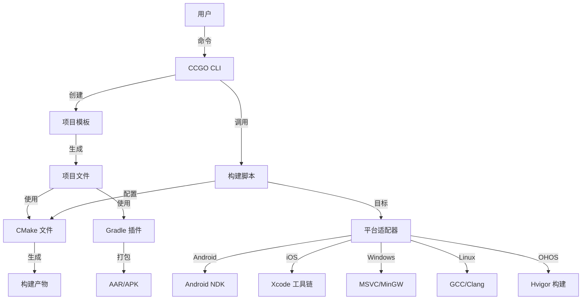

# CCGO 架构

CCGO 架构设计、组件和实现细节的综合概述。

## 概览

CCGO 设计为模块化、可扩展的跨平台构建系统，由四个主要组件组成：

```
CCGO 生态系统
├── ccgo (Python/Rust CLI)      # 命令行界面和构建编排
├── ccgo-template                # 基于 Copier 的项目模板
├── ccgo-gradle-plugins          # Gradle 约定插件
└── ccgo-now (示例)              # 参考实现
```

## 系统架构

### 高层架构

```
┌─────────────────────────────────────────────────────────────┐
│                        用户界面                              │
│  ┌──────────┐  ┌──────────┐  ┌──────────┐  ┌─────────────┐ │
│  │ CLI 工具 │  │  模板    │  │  Gradle  │  │ IDE 支持    │ │
│  │  (ccgo)  │  │  生成器  │  │  插件    │  │  (VS/Xcode) │ │
│  └─────┬────┘  └────┬─────┘  └────┬─────┘  └──────┬──────┘ │
└────────┼────────────┼─────────────┼────────────────┼────────┘
         │            │             │                │
┌────────┼────────────┼─────────────┼────────────────┼────────┐
│        │       核心服务           │                │        │
│  ┌─────▼────┐  ┌───▼────┐  ┌────▼────┐  ┌────────▼──────┐ │
│  │ 命令     │  │ 项目   │  │  构建   │  │   平台        │ │
│  │ 调度     │  │ 生成   │  │  编排   │  │   适配器      │ │
│  └─────┬────┘  └───┬────┘  └────┬────┘  └────────┬──────┘ │
└────────┼───────────┼────────────┼─────────────────┼────────┘
         │           │            │                 │
┌────────┼───────────┼────────────┼─────────────────┼────────┐
│        │      构建后端          │                 │        │
│  ┌─────▼────┐  ┌──▼─────┐  ┌───▼────┐  ┌────────▼──────┐ │
│  │  CMake   │  │ Copier │  │ 平台   │  │   工具链      │ │
│  │  模板    │  │  Jinja │  │ 脚本   │  │ (NDK/Xcode/VS)│ │
│  └──────────┘  └────────┘  └────────┘  └───────────────┘ │
└─────────────────────────────────────────────────────────────┘
```

### 组件交互



## CCGO CLI 架构

### 命令模式

```python
# CLI 结构（Python）
ccgo/
├── main.py                    # 入口点
├── cli.py                     # 根命令解析器
├── commands/                  # 命令模块
│   ├── __init__.py
│   ├── new.py                # 项目创建
│   ├── init.py               # 项目初始化
│   ├── build.py              # 构建编排
│   ├── test.py               # 测试执行
│   ├── bench.py              # 基准测试
│   ├── doc.py                # 文档生成
│   ├── publish.py            # 发布
│   ├── check.py              # 环境检查
│   ├── clean.py              # 清理
│   ├── tag.py                # Git 标签
│   ├── package.py            # 打包
│   ├── install.py            # 依赖安装
│   └── help.py               # 帮助系统
├── build_scripts/            # 平台构建脚本
│   ├── build_android.py
│   ├── build_ios.py
│   ├── build_macos.py
│   ├── build_windows.py
│   ├── build_linux.py
│   ├── build_ohos.py
│   ├── build_tvos.py
│   ├── build_watchos.py
│   ├── build_kmp.py
│   ├── build_conan.py
│   ├── build_utils.py
│   ├── dependency_manager.py
│   └── cmake/                # CMake 模板
└── utils/                    # 实用工具
    ├── context/              # CLI 上下文
    └── cmd/                  # 命令执行
```

### Rust CLI 架构（新）

```rust
// CLI 结构（Rust）
ccgo-rs/
├── src/
│   ├── main.rs               # 入口点
│   ├── cli.rs                # CLI 定义（clap）
│   ├── commands/             # 命令实现
│   │   ├── mod.rs
│   │   ├── new.rs
│   │   ├── build.rs
│   │   ├── test.rs
│   │   ├── publish.rs
│   │   └── ...
│   ├── config/               # 配置
│   │   ├── mod.rs
│   │   └── ccgo_toml.rs
│   ├── exec/                 # 进程执行
│   │   ├── mod.rs
│   │   ├── subprocess.rs
│   │   └── python.rs
│   └── utils/                # 实用工具
│       ├── mod.rs
│       ├── paths.rs
│       ├── terminal.rs
│       └── git_version.rs
└── Cargo.toml
```

### 命令执行流程

```
1. 用户输入
   └─> ccgo build android --arch arm64-v8a

2. CLI 解析（cli.py / cli.rs）
   └─> 路由到 commands/build.py::Build 类

3. 命令执行（build.py）
   ├─> 解析参数
   ├─> 从项目加载 build_config.py
   ├─> 导入 build_scripts/build_android.py
   └─> 执行 build_android.main()

4. 平台构建脚本（build_android.py）
   ├─> 验证环境（NDK、SDK）
   ├─> 使用工具链配置 CMake
   ├─> 从模板生成 CMakeLists.txt
   ├─> 执行 CMake 配置
   ├─> 执行 CMake 构建
   └─> 打包产物（SO、AAR）

5. 输出
   └─> target/android/arm64-v8a/libproject.so
       target/android/project.aar
```

## 模板架构

### Copier 集成

```
ccgo-template/
├── copier.yml                # 模板配置
├── copier_extensions.py      # Jinja2 扩展
└── template/                 # 模板文件
    └── {{cpy_project_relative_path}}/
        ├── CCGO.toml.jinja   # 项目配置
        ├── CMakeLists.txt.jinja
        ├── build.py.jinja
        ├── build_config.py.jinja
        └── src/
            └── {{cpy_project_name}}.cpp.jinja
```

### 模板变量

```yaml
# copier.yml
project_name:
  type: str
  help: 项目名称（小写，无空格）

project_description:
  type: str
  help: 简短的项目描述

project_license:
  type: str
  choices:
    - MIT
    - Apache-2.0
    - GPL-3.0
  default: MIT

target_platforms:
  type: str
  choices:
    - All
    - Mobile (Android + iOS)
    - Desktop (macOS + Windows + Linux)
  default: All
```

### Jinja2 扩展

```python
# copier_extensions.py

class GitExtension(StandaloneTag):
    def get_current_branch(self):
        return subprocess.check_output(
            ["git", "branch", "--show-current"]
        ).decode().strip()

class SlugifyExtension(Extension):
    def slug(self, text):
        return text.lower().replace(" ", "-")

class CurrentYearExtension(Extension):
    def year(self):
        return datetime.now().year
```

## 构建系统架构

### CMake 层

```
构建过程流程
┌─────────────────────────────────────────────────────┐
│ 1. 配置阶段                                         │
│    ├─> 读取 CCGO.toml                              │
│    ├─> 检测平台                                    │
│    ├─> 设置 CCGO_CMAKE_DIR 环境变量                │
│    └─> 传递给 CMake                                │
└──────────────────┬──────────────────────────────────┘
                   │
┌──────────────────▼──────────────────────────────────┐
│ 2. CMake 配置                                       │
│    ├─> 包含 CCGO CMake 实用工具                    │
│    ├─> 应用平台工具链                              │
│    ├─> 配置编译器标志                              │
│    ├─> 解析依赖                                    │
│    └─> 生成构建文件                                │
└──────────────────┬──────────────────────────────────┘
                   │
┌──────────────────▼──────────────────────────────────┐
│ 3. 构建阶段                                         │
│    ├─> 编译源文件                                  │
│    ├─> 链接库                                      │
│    ├─> 应用平台特定设置                            │
│    └─> 生成产物                                    │
└──────────────────┬──────────────────────────────────┘
                   │
┌──────────────────▼──────────────────────────────────┐
│ 4. 打包阶段                                         │
│    ├─> 收集产物                                    │
│    ├─> 剥离符号（如果是发布版）                    │
│    ├─> 创建归档（ZIP）                             │
│    └─> 生成构建元数据（JSON）                      │
└─────────────────────────────────────────────────────┘
```

### 平台适配器

每个平台都有专用的构建脚本：

```python
# build_android.py
class AndroidBuilder:
    def __init__(self, config):
        self.config = config
        self.ndk_path = self._find_ndk()
        self.sdk_path = self._find_sdk()

    def configure(self):
        """使用 Android 工具链配置 CMake"""
        toolchain = os.path.join(
            self.ndk_path,
            "build/cmake/android.toolchain.cmake"
        )
        cmake_args = [
            f"-DCMAKE_TOOLCHAIN_FILE={toolchain}",
            f"-DANDROID_ABI={self.config.arch}",
            f"-DANDROID_PLATFORM=android-{self.config.min_sdk}",
            f"-DCCGO_CMAKE_DIR={self.ccgo_cmake_dir}",
        ]
        return cmake_args

    def build(self):
        """执行 CMake 构建"""
        # 生成构建文件
        run_cmd(["cmake", *self.configure(), ".."])

        # 构建
        run_cmd(["cmake", "--build", ".", "--config", "Release"])

    def package(self):
        """打包 AAR 和 SO 文件"""
        # 收集 SO 文件
        # 生成 AAR
        # 创建归档
```

### 依赖管理

```python
# dependency_manager.py
class DependencyManager:
    def __init__(self, project_dir):
        self.ccgo_toml = self._load_ccgo_toml(project_dir)
        self.dependencies = self.ccgo_toml.get("dependencies", {})

    def resolve(self, platform):
        """解析平台的依赖"""
        resolved = []

        for name, spec in self.dependencies.items():
            dep = self._resolve_single(name, spec, platform)
            resolved.append(dep)

        return resolved

    def _resolve_single(self, name, spec, platform):
        """解析单个依赖"""
        if "git" in spec:
            return self._resolve_git(name, spec)
        elif "path" in spec:
            return self._resolve_path(name, spec)
        elif "version" in spec:
            return self._resolve_version(name, spec, platform)
```

## Gradle 插件架构

### 插件层次结构

```kotlin
// 约定插件结构
com.mojeter.ccgo.gradle.android
├── .library                   # 基础库插件
│   ├── .native
│   │   ├── .python           # 基于 Python 的构建
│   │   └── .cmake            # 基于 CMake 的构建
│   └── (基础配置)
├── .application               # 基础应用插件
│   ├── .native
│   │   ├── .python
│   │   └── .cmake
│   └── (基础配置)
├── .feature                   # 功能模块插件
└── .publish                   # 发布插件
```

### 插件应用链

```
用户应用：android.library.native.python
    │
    ├─> 应用：android.library（基础）
    │       │
    │       ├─> 应用：com.android.library
    │       ├─> 应用：org.jetbrains.kotlin.android
    │       └─> 配置：标准 Android 设置
    │
    └─> 添加：CCGO 原生构建支持
            │
            ├─> 创建：ccgoNative 扩展
            ├─> 注册：buildCcgoNative 任务
            ├─> 注册：cleanCcgoNative 任务
            └─> 挂钩：预构建依赖
```

### 原生构建集成

```kotlin
// 插件实现
class CcgoNativePlugin : Plugin<Project> {
    override fun apply(project: Project) {
        // 创建扩展
        val extension = project.extensions.create(
            "ccgoNative",
            CcgoNativeExtension::class.java
        )

        // 注册构建任务
        project.tasks.register(
            "buildCcgoNative",
            CcgoNativeBuildTask::class.java
        ) { task ->
            task.projectDir.set(extension.projectDir)
            task.architectures.set(extension.architectures)
            task.buildType.set(extension.buildType)
        }

        // 挂钩到 Android 构建
        project.afterEvaluate {
            project.tasks.named("preBuild") {
                dependsOn("buildCcgoNative")
            }
        }
    }
}
```

## Docker 架构

### 多阶段构建

```dockerfile
# Dockerfile.android（示例）
FROM ubuntu:22.04 as base
RUN apt-get update && apt-get install -y \
    build-essential cmake ninja-build

FROM base as android-deps
# 安装 Android SDK/NDK
RUN wget https://dl.google.com/android/repository/...

FROM android-deps as builder
# 构建环境
WORKDIR /workspace
COPY . .
RUN ccgo build android --arch arm64-v8a,x86_64

FROM scratch as output
# 提取产物
COPY --from=builder /workspace/target/android /output
```

### 构建编排

```python
# build_docker.py
class DockerBuilder:
    def __init__(self, platform, config):
        self.platform = platform
        self.config = config
        self.image_name = f"ccgo-builder-{platform}"

    def build_image(self):
        """构建或拉取 Docker 镜像"""
        if self._image_exists():
            return

        dockerfile = self._get_dockerfile()
        run_cmd([
            "docker", "build",
            "-f", dockerfile,
            "-t", self.image_name,
            "."
        ])

    def build_in_container(self):
        """在容器内执行构建"""
        run_cmd([
            "docker", "run",
            "--rm",
            "-v", f"{self.project_dir}:/workspace",
            "-w", "/workspace",
            self.image_name,
            "ccgo", "build", self.platform,
            *self.config.extra_args
        ])
```

## 版本管理架构

### 版本注入管道

```
CCGO.toml (version = "1.2.3")
    │
    ├─> 由构建脚本读取
    │       │
    │       ├─> 解析语义化版本
    │       ├─> 获取 git 信息
    │       │   ├─> 提交 SHA
    │       │   ├─> 分支名称
    │       │   └─> 脏状态
    │       └─> 生成版本头文件
    │               │
    │               ├─> version.h (C++)
    │               ├─> build_info.json (元数据)
    │               └─> 平台特定
    │                   ├─> Android: version_code
    │                   ├─> iOS: build_number
    │                   └─> Windows: file_version
    │
    └─> CMake 配置
            │
            ├─> 设置 PROJECT_VERSION
            ├─> 设置 GIT_SHA
            ├─> 设置 GIT_BRANCH
            └─> configure_file(version.h.in)
```

### 归档结构

```
统一归档格式
{PROJECT}_{PLATFORM}_SDK-{VERSION}.zip
├── lib/
│   ├── static/
│   │   └── {arch}/              # 静态库
│   └── shared/
│       └── {arch}/              # 动态库
├── frameworks/                  # Apple 平台
│   ├── static/
│   └── shared/
├── haars/                       # Android/OHOS 包
├── include/                     # 公共头文件
└── build_info.json              # 构建元数据

{PROJECT}_{PLATFORM}_SDK-{VERSION}-SYMBOLS.zip
├── symbols/
│   ├── static/                  # 静态库的 dSYM、PDB
│   └── shared/                  # 动态库的 dSYM、PDB
└── obj/                         # 未剥离的库
```

## 扩展点

### 自定义命令

```python
# ccgo/commands/custom.py
from utils.context import CliCommand

class Custom(CliCommand):
    @staticmethod
    def description():
        return "自定义命令描述"

    @staticmethod
    def cli():
        parser = argparse.ArgumentParser()
        parser.add_argument("--option", help="自定义选项")
        return parser

    @staticmethod
    def exec(context, args):
        # 自定义命令实现
        print(f"使用 {args.option} 执行自定义命令")
        return CliResult.success()
```

### 自定义平台

```python
# build_scripts/build_custom.py
def main(build_config):
    """自定义平台构建脚本"""

    # 配置
    cmake_args = [
        "-DCMAKE_SYSTEM_NAME=Custom",
        "-DCMAKE_C_COMPILER=custom-gcc",
        "-DCMAKE_CXX_COMPILER=custom-g++",
    ]

    # 构建
    run_cmake_build(build_config, cmake_args)

    # 打包
    package_artifacts(build_config)
```

### 自定义模板

```yaml
# copier.yml 扩展
_jinja_extensions:
  - copier_templates.GitExtension
  - my_extensions.CustomExtension

custom_config:
  type: str
  when: "{{ project_type == 'custom' }}"
  help: 自定义配置选项
```

## 性能考虑

### 构建缓存

```python
# 增量构建
class BuildCache:
    def __init__(self, cache_dir):
        self.cache_dir = cache_dir
        self.manifest = self._load_manifest()

    def is_cached(self, source_files):
        """检查构建是否已缓存"""
        current_hash = self._compute_hash(source_files)
        cached_hash = self.manifest.get("hash")
        return current_hash == cached_hash

    def save(self, source_files, artifacts):
        """保存构建到缓存"""
        self.manifest["hash"] = self._compute_hash(source_files)
        self.manifest["artifacts"] = artifacts
        self._save_manifest()
```

### 并行构建

```python
# 多线程 CMake 构建
def build_all_architectures(architectures):
    with ThreadPoolExecutor(max_workers=len(architectures)) as executor:
        futures = []
        for arch in architectures:
            future = executor.submit(build_architecture, arch)
            futures.append(future)

        for future in as_completed(futures):
            result = future.result()
            print(f"构建完成：{result}")
```

## 测试架构

### 单元测试

```python
# tests/test_build_android.py
import unittest
from build_scripts.build_android import AndroidBuilder

class TestAndroidBuilder(unittest.TestCase):
    def test_configure(self):
        builder = AndroidBuilder(mock_config)
        args = builder.configure()
        self.assertIn("-DANDROID_ABI=arm64-v8a", args)

    def test_ndk_detection(self):
        builder = AndroidBuilder(mock_config)
        ndk_path = builder._find_ndk()
        self.assertTrue(os.path.exists(ndk_path))
```

### 集成测试

```bash
# tests/integration/test_build_workflow.sh
#!/bin/bash

# 创建测试项目
ccgo new test-project --defaults
cd test-project/test-project

# 为 Android 构建
ccgo build android --arch arm64-v8a

# 验证输出
test -f target/android/arm64-v8a/libtest-project.so

# 清理
cd ../..
rm -rf test-project
```

## 资源

### 架构文档

- [CLI 设计模式](https://clig.dev/)
- [CMake 最佳实践](https://cmake.org/cmake/help/latest/guide/user-interaction/index.html)
- [Gradle 插件开发](https://docs.gradle.org/current/userguide/custom_plugins.html)

### CCGO 文档

- [CLI 参考](../reference/cli.zh.md)
- [构建系统](../features/build-system.zh.md)
- [CMake 集成](../reference/cmake.zh.md)
- [Gradle 插件](../reference/gradle-plugins.zh.md)

### 社区

- [GitHub 讨论](https://github.com/zhlinh/ccgo/discussions)
- [问题追踪](https://github.com/zhlinh/ccgo/issues)
- [贡献指南](contributing.zh.md)

## 下一步

- [贡献指南](contributing.zh.md)
- [更新日志](changelog.zh.md)
- [开发路线图](roadmap.zh.md)
