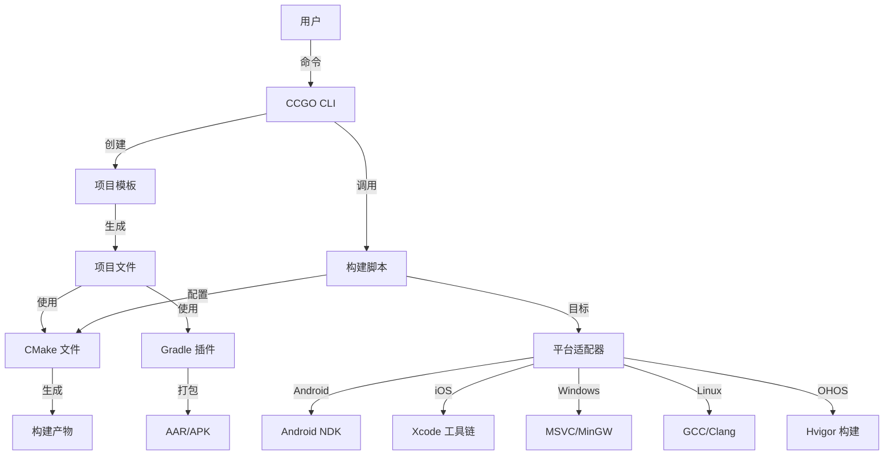

# CCGO 架构

CCGO 架构设计、组件和实现细节的综合概述。

## 概览

CCGO 设计为模块化、可扩展的跨平台构建系统，由四个主要组件组成：

```
CCGO 生态系统
├── ccgo (Rust CLI)              # 命令行界面和构建编排
├── ccgo-template                # 基于 Copier 的项目模板
├── ccgo-gradle-plugins          # Gradle 约定插件
└── ccgo-now (示例)              # 参考实现
```

## 系统架构

### 高层架构

```
┌─────────────────────────────────────────────────────────────┐
│                        用户界面                              │
│  ┌──────────┐  ┌──────────┐  ┌──────────┐  ┌─────────────┐ │
│  │ CLI 工具 │  │  模板    │  │  Gradle  │  │ IDE 支持    │ │
│  │  (ccgo)  │  │  生成器  │  │  插件    │  │  (VS/Xcode) │ │
│  └─────┬────┘  └────┬─────┘  └────┬─────┘  └──────┬──────┘ │
└────────┼────────────┼─────────────┼────────────────┼────────┘
         │            │             │                │
┌────────┼────────────┼─────────────┼────────────────┼────────┐
│        │       核心服务           │                │        │
│  ┌─────▼────┐  ┌───▼────┐  ┌────▼────┐  ┌────────▼──────┐ │
│  │ 命令     │  │ 项目   │  │  构建   │  │   平台        │ │
│  │ 调度     │  │ 生成   │  │  编排   │  │   适配器      │ │
│  └─────┬────┘  └───┬────┘  └────┬────┘  └────────┬──────┘ │
└────────┼───────────┼────────────┼─────────────────┼────────┘
         │           │            │                 │
┌────────┼───────────┼────────────┼─────────────────┼────────┐
│        │      构建后端          │                 │        │
│  ┌─────▼────┐  ┌──▼─────┐  ┌───▼────┐  ┌────────▼──────┐ │
│  │  CMake   │  │ Copier │  │ 平台   │  │   工具链      │ │
│  │  模板    │  │  Jinja │  │ 脚本   │  │ (NDK/Xcode/VS)│ │
│  └──────────┘  └────────┘  └────────┘  └───────────────┘ │
└─────────────────────────────────────────────────────────────┘
```

### 组件交互



## CCGO CLI 架构

### 命令模式

CCGO CLI 使用 Rust 和 `clap` crate 构建，用于命令行解析。它遵循模块化的命令模式：

```rust
// CLI 结构（Rust）
src/
├── main.rs                   # 入口点
├── cli.rs                    # CLI 定义（clap derive）
├── commands/                 # 命令实现
│   ├── mod.rs               # 命令模块导出
│   ├── new.rs               # 项目创建（ccgo new）
│   ├── init.rs              # 项目初始化（ccgo init）
│   ├── build.rs             # 构建编排（ccgo build）
│   ├── test.rs              # 测试执行（ccgo test）
│   ├── bench.rs             # 基准测试（ccgo bench）
│   ├── doc.rs               # 文档生成（ccgo doc）
│   ├── publish.rs           # 发布（ccgo publish）
│   ├── check.rs             # 环境检查（ccgo check）
│   ├── clean.rs             # 清理（ccgo clean）
│   ├── tag.rs               # Git 标签（ccgo tag）
│   ├── package.rs           # 打包（ccgo package）
│   ├── install.rs           # 依赖安装（ccgo install）
│   ├── add.rs               # 添加依赖（ccgo add）
│   ├── remove.rs            # 移除依赖（ccgo remove）
│   ├── tree.rs              # 依赖树（ccgo tree）
│   ├── search.rs            # 包搜索（ccgo search）
│   ├── registry.rs          # 注册表管理（ccgo registry）
│   ├── update.rs            # 更新依赖（ccgo update）
│   ├── vendor.rs            # 依赖打包（ccgo vendor）
│   ├── run.rs               # 运行示例（ccgo run）
│   └── analytics.rs         # 构建分析（ccgo analytics）
├── config/                   # 配置解析
│   ├── mod.rs               # 配置模块导出
│   └── ccgo_toml.rs         # CCGO.toml 解析
├── builders/                 # 平台构建器
│   ├── mod.rs               # 构建器 trait 和通用代码
│   ├── android.rs           # Android 构建器
│   ├── ios.rs               # iOS 构建器
│   ├── macos.rs             # macOS 构建器
│   ├── windows.rs           # Windows 构建器
│   ├── linux.rs             # Linux 构建器
│   ├── ohos.rs              # OpenHarmony 构建器
│   ├── tvos.rs              # tvOS 构建器
│   ├── watchos.rs           # watchOS 构建器
│   └── kmp.rs               # Kotlin Multiplatform 构建器
├── registry/                 # 包注册表
│   ├── mod.rs               # 注册表模块导出
│   ├── index.rs             # 索引解析和缓存
│   ├── resolver.rs          # 版本解析
│   └── graph.rs             # 依赖图
├── exec/                     # 进程执行
│   ├── mod.rs               # 执行工具
│   └── subprocess.rs        # 子进程管理
└── utils/                    # 实用工具
    ├── mod.rs               # 工具导出
    ├── paths.rs             # 路径工具
    ├── terminal.rs          # 终端输出（颜色、进度）
    ├── git.rs               # Git 操作
    └── cmake.rs             # CMake 集成
```

### 命令执行流程

```
1. 用户输入
   └─> ccgo build android --arch arm64-v8a

2. CLI 解析（cli.rs 使用 clap）
   └─> 匹配 Commands::Build 变体
   └─> 调度到 commands/build.rs

3. 命令执行（build.rs）
   ├─> 从 clap 解析 BuildArgs
   ├─> 加载 CCGO.toml 配置
   ├─> 选择适当的平台构建器
   └─> 执行 builder.build()

4. 平台构建器（builders/android.rs）
   ├─> 验证环境（NDK、SDK）
   ├─> 使用工具链配置 CMake
   ├─> 设置 CCGO_CMAKE_DIR 用于 CMake 工具
   ├─> 执行 CMake 配置
   ├─> 执行 CMake 构建（支持缓存）
   └─> 打包产物（SO、AAR）

5. 输出
   └─> cmake_build/Android/arm64-v8a/libproject.so
       cmake_build/Android/Android.out/project.aar
```

### 命令实现示例

```rust
// commands/build.rs
use clap::Args;
use anyhow::Result;
use crate::builders::{AndroidBuilder, IosBuilder, Platform};
use crate::config::CcgoConfig;

#[derive(Args)]
pub struct BuildArgs {
    /// 目标平台
    pub platform: String,

    /// 目标架构
    #[arg(long, value_delimiter = ',')]
    pub arch: Option<Vec<String>>,

    /// 构建类型（debug/release）
    #[arg(long, default_value = "release")]
    pub build_type: String,

    /// 启用构建缓存（ccache/sccache）
    #[arg(long, default_value = "auto")]
    pub cache: String,
}

impl BuildArgs {
    pub fn execute(&self) -> Result<()> {
        let config = CcgoConfig::load()?;

        match self.platform.as_str() {
            "android" => AndroidBuilder::new(&config, self).build()?,
            "ios" => IosBuilder::new(&config, self).build()?,
            // ... 其他平台
            _ => anyhow::bail!("未知平台：{}", self.platform),
        }

        Ok(())
    }
}
```

## 模板架构

### Copier 集成

```
ccgo-template/
├── copier.yml                # 模板配置
├── copier_extensions.py      # Jinja2 扩展
└── template/                 # 模板文件
    └── {{cpy_project_relative_path}}/
        ├── CCGO.toml.jinja   # 项目配置
        ├── CMakeLists.txt.jinja
        ├── build.py.jinja
        ├── build_config.py.jinja
        └── src/
            └── {{cpy_project_name}}.cpp.jinja
```

### 模板变量

```yaml
# copier.yml
project_name:
  type: str
  help: 项目名称（小写，无空格）

project_description:
  type: str
  help: 简短的项目描述

project_license:
  type: str
  choices:
    - MIT
    - Apache-2.0
    - GPL-3.0
  default: MIT

target_platforms:
  type: str
  choices:
    - All
    - Mobile (Android + iOS)
    - Desktop (macOS + Windows + Linux)
  default: All
```

### Jinja2 扩展

```python
# copier_extensions.py

class GitExtension(StandaloneTag):
    def get_current_branch(self):
        return subprocess.check_output(
            ["git", "branch", "--show-current"]
        ).decode().strip()

class SlugifyExtension(Extension):
    def slug(self, text):
        return text.lower().replace(" ", "-")

class CurrentYearExtension(Extension):
    def year(self):
        return datetime.now().year
```

## 构建系统架构

### CMake 层

```
构建过程流程
┌─────────────────────────────────────────────────────┐
│ 1. 配置阶段                                         │
│    ├─> 读取 CCGO.toml                              │
│    ├─> 检测平台                                    │
│    ├─> 设置 CCGO_CMAKE_DIR 环境变量                │
│    └─> 传递给 CMake                                │
└──────────────────┬──────────────────────────────────┘
                   │
┌──────────────────▼──────────────────────────────────┐
│ 2. CMake 配置                                       │
│    ├─> 包含 CCGO CMake 实用工具                    │
│    ├─> 应用平台工具链                              │
│    ├─> 配置编译器标志                              │
│    ├─> 解析依赖                                    │
│    └─> 生成构建文件                                │
└──────────────────┬──────────────────────────────────┘
                   │
┌──────────────────▼──────────────────────────────────┐
│ 3. 构建阶段                                         │
│    ├─> 编译源文件                                  │
│    ├─> 链接库                                      │
│    ├─> 应用平台特定设置                            │
│    └─> 生成产物                                    │
└──────────────────┬──────────────────────────────────┘
                   │
┌──────────────────▼──────────────────────────────────┐
│ 4. 打包阶段                                         │
│    ├─> 收集产物                                    │
│    ├─> 剥离符号（如果是发布版）                    │
│    ├─> 创建归档（ZIP）                             │
│    └─> 生成构建元数据（JSON）                      │
└─────────────────────────────────────────────────────┘
```

### 平台适配器

每个平台都有专用的构建器，实现 `PlatformBuilder` trait：

```rust
// builders/mod.rs
pub trait PlatformBuilder {
    fn new(config: &CcgoConfig, args: &BuildArgs) -> Result<Self> where Self: Sized;
    fn validate_environment(&self) -> Result<()>;
    fn configure_cmake(&self) -> Result<Vec<String>>;
    fn build(&self) -> Result<()>;
    fn package(&self) -> Result<PathBuf>;
}

// builders/android.rs
pub struct AndroidBuilder {
    config: CcgoConfig,
    ndk_path: PathBuf,
    sdk_path: PathBuf,
    architectures: Vec<String>,
    build_type: BuildType,
    cache_type: CacheType,
}

impl PlatformBuilder for AndroidBuilder {
    fn new(config: &CcgoConfig, args: &BuildArgs) -> Result<Self> {
        let ndk_path = Self::find_ndk()?;
        let sdk_path = Self::find_sdk()?;
        Ok(Self {
            config: config.clone(),
            ndk_path,
            sdk_path,
            architectures: args.arch.clone().unwrap_or_default(),
            build_type: args.build_type.parse()?,
            cache_type: args.cache.parse()?,
        })
    }

    fn configure_cmake(&self) -> Result<Vec<String>> {
        let toolchain = self.ndk_path
            .join("build/cmake/android.toolchain.cmake");

        Ok(vec![
            format!("-DCMAKE_TOOLCHAIN_FILE={}", toolchain.display()),
            format!("-DANDROID_ABI={}", self.current_arch),
            format!("-DANDROID_PLATFORM=android-{}", self.config.android.min_sdk),
            format!("-DCCGO_CMAKE_DIR={}", self.ccgo_cmake_dir().display()),
            self.cache_type.cmake_args(),
        ])
    }

    fn build(&self) -> Result<()> {
        self.validate_environment()?;

        for arch in &self.architectures {
            let build_dir = self.build_dir(arch);
            std::fs::create_dir_all(&build_dir)?;

            // 配置
            let cmake_args = self.configure_cmake()?;
            Command::new("cmake")
                .current_dir(&build_dir)
                .args(&cmake_args)
                .arg("..")
                .status()?;

            // 构建
            Command::new("cmake")
                .current_dir(&build_dir)
                .args(["--build", ".", "--config", self.build_type.as_str()])
                .status()?;
        }

        self.package()?;
        Ok(())
    }
}
```

### 依赖管理

```rust
// registry/resolver.rs
pub struct DependencyResolver {
    registries: Vec<Registry>,
    cache_dir: PathBuf,
}

impl DependencyResolver {
    pub fn new() -> Result<Self> {
        let registries = Registry::load_all()?;
        let cache_dir = ccgo_home_path().join("deps");
        Ok(Self { registries, cache_dir })
    }

    pub fn resolve(&self, config: &CcgoConfig) -> Result<Vec<ResolvedDep>> {
        let mut resolved = Vec::new();
        let mut graph = DependencyGraph::new();

        for dep in &config.dependencies {
            let resolved_dep = self.resolve_single(dep)?;
            graph.add_dependency(&resolved_dep)?;
            resolved.push(resolved_dep);
        }

        // 检测循环
        graph.detect_cycles()?;

        // 拓扑排序以确保正确的构建顺序
        Ok(graph.topological_sort()?)
    }

    fn resolve_single(&self, dep: &DependencyConfig) -> Result<ResolvedDep> {
        match dep {
            DependencyConfig::Git { git, branch, tag, .. } => {
                self.resolve_git(git, branch.as_ref().or(tag.as_ref()))
            }
            DependencyConfig::Path { path, .. } => {
                self.resolve_path(path)
            }
            DependencyConfig::Registry { version, registry, .. } => {
                self.resolve_registry(dep.name(), version, registry.as_deref())
            }
        }
    }

    fn resolve_registry(
        &self,
        name: &str,
        version: &str,
        registry: Option<&str>,
    ) -> Result<ResolvedDep> {
        let registry = self.find_registry(registry)?;
        let package = registry.lookup_package(name)?;
        let matched_version = package.resolve_version(version)?;

        Ok(ResolvedDep {
            name: name.to_string(),
            version: matched_version.version.clone(),
            source: Source::Git {
                url: package.repository.clone(),
                reference: matched_version.git_tag.clone(),
            },
            checksum: matched_version.checksum.clone(),
        })
    }
}
```

## Gradle 插件架构

### 插件层次结构

```kotlin
// 约定插件结构
com.mojeter.ccgo.gradle.android
├── .library                   # 基础库插件
│   ├── .native
│   │   ├── .python           # 基于 Python 的构建
│   │   └── .cmake            # 基于 CMake 的构建
│   └── (基础配置)
├── .application               # 基础应用插件
│   ├── .native
│   │   ├── .python
│   │   └── .cmake
│   └── (基础配置)
├── .feature                   # 功能模块插件
└── .publish                   # 发布插件
```

### 插件应用链

```
用户应用：android.library.native.python
    │
    ├─> 应用：android.library（基础）
    │       │
    │       ├─> 应用：com.android.library
    │       ├─> 应用：org.jetbrains.kotlin.android
    │       └─> 配置：标准 Android 设置
    │
    └─> 添加：CCGO 原生构建支持
            │
            ├─> 创建：ccgoNative 扩展
            ├─> 注册：buildCcgoNative 任务
            ├─> 注册：cleanCcgoNative 任务
            └─> 挂钩：预构建依赖
```

### 原生构建集成

```kotlin
// 插件实现
class CcgoNativePlugin : Plugin<Project> {
    override fun apply(project: Project) {
        // 创建扩展
        val extension = project.extensions.create(
            "ccgoNative",
            CcgoNativeExtension::class.java
        )

        // 注册构建任务
        project.tasks.register(
            "buildCcgoNative",
            CcgoNativeBuildTask::class.java
        ) { task ->
            task.projectDir.set(extension.projectDir)
            task.architectures.set(extension.architectures)
            task.buildType.set(extension.buildType)
        }

        // 挂钩到 Android 构建
        project.afterEvaluate {
            project.tasks.named("preBuild") {
                dependsOn("buildCcgoNative")
            }
        }
    }
}
```

## Docker 架构

### 多阶段构建

```dockerfile
# Dockerfile.android（示例）
FROM ubuntu:22.04 as base
RUN apt-get update && apt-get install -y \
    build-essential cmake ninja-build

FROM base as android-deps
# 安装 Android SDK/NDK
RUN wget https://dl.google.com/android/repository/...

FROM android-deps as builder
# 构建环境
WORKDIR /workspace
COPY . .
RUN ccgo build android --arch arm64-v8a,x86_64

FROM scratch as output
# 提取产物
COPY --from=builder /workspace/target/android /output
```

### 构建编排

```rust
// builders/docker.rs
pub struct DockerBuilder {
    platform: Platform,
    config: CcgoConfig,
    image_name: String,
}

impl DockerBuilder {
    pub fn new(platform: Platform, config: &CcgoConfig) -> Self {
        let image_name = format!("ccgo-builder-{}", platform.as_str());
        Self {
            platform,
            config: config.clone(),
            image_name,
        }
    }

    pub fn build_image(&self) -> Result<()> {
        if self.image_exists()? {
            return Ok(());
        }

        let dockerfile = self.get_dockerfile()?;
        Command::new("docker")
            .args(["build", "-f", &dockerfile, "-t", &self.image_name, "."])
            .status()?;
        Ok(())
    }

    pub fn build_in_container(&self, project_dir: &Path) -> Result<()> {
        let mount = format!("{}:/workspace", project_dir.display());
        Command::new("docker")
            .args([
                "run", "--rm",
                "-v", &mount,
                "-w", "/workspace",
                &self.image_name,
                "ccgo", "build", self.platform.as_str(),
            ])
            .status()?;
        Ok(())
    }
}
```

## 版本管理架构

### 版本注入管道

```
CCGO.toml (version = "1.2.3")
    │
    ├─> 由构建脚本读取
    │       │
    │       ├─> 解析语义化版本
    │       ├─> 获取 git 信息
    │       │   ├─> 提交 SHA
    │       │   ├─> 分支名称
    │       │   └─> 脏状态
    │       └─> 生成版本头文件
    │               │
    │               ├─> version.h (C++)
    │               ├─> build_info.json (元数据)
    │               └─> 平台特定
    │                   ├─> Android: version_code
    │                   ├─> iOS: build_number
    │                   └─> Windows: file_version
    │
    └─> CMake 配置
            │
            ├─> 设置 PROJECT_VERSION
            ├─> 设置 GIT_SHA
            ├─> 设置 GIT_BRANCH
            └─> configure_file(version.h.in)
```

### 归档结构

```
统一归档格式
{PROJECT}_{PLATFORM}_SDK-{VERSION}.zip
├── lib/
│   ├── static/
│   │   └── {arch}/              # 静态库
│   └── shared/
│       └── {arch}/              # 动态库
├── frameworks/                  # Apple 平台
│   ├── static/
│   └── shared/
├── haars/                       # Android/OHOS 包
├── include/                     # 公共头文件
└── build_info.json              # 构建元数据

{PROJECT}_{PLATFORM}_SDK-{VERSION}-SYMBOLS.zip
├── symbols/
│   ├── static/                  # 静态库的 dSYM、PDB
│   └── shared/                  # 动态库的 dSYM、PDB
└── obj/                         # 未剥离的库
```

## 扩展点

### 自定义命令

可以通过实现命令模块并在 CLI 中注册来添加新命令：

```rust
// commands/custom.rs
use clap::Args;
use anyhow::Result;

#[derive(Args)]
pub struct CustomArgs {
    /// 自定义选项
    #[arg(long)]
    pub option: Option<String>,
}

impl CustomArgs {
    pub fn execute(&self) -> Result<()> {
        println!("使用 {:?} 执行自定义命令", self.option);
        // 自定义命令实现
        Ok(())
    }
}

// cli.rs - 注册命令
#[derive(Subcommand)]
pub enum Commands {
    // ... 现有命令
    /// 自定义命令描述
    Custom(CustomArgs),
}
```

### 自定义平台

可以通过实现 `PlatformBuilder` trait 来添加新平台：

```rust
// builders/custom.rs
pub struct CustomBuilder {
    config: CcgoConfig,
    build_args: BuildArgs,
}

impl PlatformBuilder for CustomBuilder {
    fn new(config: &CcgoConfig, args: &BuildArgs) -> Result<Self> {
        Ok(Self {
            config: config.clone(),
            build_args: args.clone(),
        })
    }

    fn validate_environment(&self) -> Result<()> {
        // 检查自定义工具链
        which::which("custom-gcc")?;
        which::which("custom-g++")?;
        Ok(())
    }

    fn configure_cmake(&self) -> Result<Vec<String>> {
        Ok(vec![
            "-DCMAKE_SYSTEM_NAME=Custom".to_string(),
            "-DCMAKE_C_COMPILER=custom-gcc".to_string(),
            "-DCMAKE_CXX_COMPILER=custom-g++".to_string(),
            format!("-DCCGO_CMAKE_DIR={}", self.ccgo_cmake_dir().display()),
        ])
    }

    fn build(&self) -> Result<()> {
        self.validate_environment()?;
        // 运行 CMake 配置和构建
        self.run_cmake_build()?;
        self.package()?;
        Ok(())
    }
}
```

### 自定义模板

```yaml
# copier.yml 扩展
_jinja_extensions:
  - copier_templates.GitExtension
  - my_extensions.CustomExtension

custom_config:
  type: str
  when: "{{ project_type == 'custom' }}"
  help: 自定义配置选项
```

## 性能考虑

### 构建缓存

CCGO 集成了 ccache 和 sccache 用于编译器缓存：

```rust
// builders/cache.rs
pub enum CacheType {
    Auto,    // 自动检测（优先 sccache > ccache）
    Ccache,
    Sccache,
    None,
}

impl CacheType {
    pub fn detect() -> Self {
        if which::which("sccache").is_ok() {
            CacheType::Sccache
        } else if which::which("ccache").is_ok() {
            CacheType::Ccache
        } else {
            CacheType::None
        }
    }

    pub fn cmake_args(&self) -> Vec<String> {
        match self {
            CacheType::Sccache => vec![
                "-DCMAKE_C_COMPILER_LAUNCHER=sccache".to_string(),
                "-DCMAKE_CXX_COMPILER_LAUNCHER=sccache".to_string(),
            ],
            CacheType::Ccache => vec![
                "-DCMAKE_C_COMPILER_LAUNCHER=ccache".to_string(),
                "-DCMAKE_CXX_COMPILER_LAUNCHER=ccache".to_string(),
            ],
            _ => vec![],
        }
    }
}
```

### 并行构建

多架构构建使用 Rayon 并行执行：

```rust
// builders/mod.rs
use rayon::prelude::*;

pub fn build_all_architectures(
    builder: &impl PlatformBuilder,
    architectures: &[String],
) -> Result<Vec<BuildResult>> {
    architectures
        .par_iter()
        .map(|arch| {
            println!("正在构建 {}", arch);
            builder.build_arch(arch)
        })
        .collect()
}

// 示例：为多架构并行构建 Android
pub fn build_android_parallel(config: &CcgoConfig, args: &BuildArgs) -> Result<()> {
    let architectures = args.arch.clone()
        .unwrap_or_else(|| vec![
            "armeabi-v7a".to_string(),
            "arm64-v8a".to_string(),
            "x86_64".to_string(),
        ]);

    let builder = AndroidBuilder::new(config, args)?;
    let results = build_all_architectures(&builder, &architectures)?;

    for result in results {
        println!("完成：{} 耗时 {:?}", result.arch, result.duration);
    }

    Ok(())
}
```

## 测试架构

### 单元测试

```rust
// tests/builders/android_test.rs
#[cfg(test)]
mod tests {
    use super::*;
    use crate::config::CcgoConfig;
    use crate::builders::android::AndroidBuilder;

    #[test]
    fn test_configure_cmake() {
        let config = CcgoConfig::mock();
        let args = BuildArgs {
            arch: Some(vec!["arm64-v8a".to_string()]),
            build_type: "release".to_string(),
            ..Default::default()
        };

        let builder = AndroidBuilder::new(&config, &args).unwrap();
        let cmake_args = builder.configure_cmake().unwrap();

        assert!(cmake_args.iter().any(|a| a.contains("ANDROID_ABI=arm64-v8a")));
        assert!(cmake_args.iter().any(|a| a.contains("android.toolchain.cmake")));
    }

    #[test]
    fn test_ndk_detection() {
        // 如果未安装 NDK 则跳过
        if std::env::var("ANDROID_NDK_HOME").is_err() {
            return;
        }

        let ndk_path = AndroidBuilder::find_ndk().unwrap();
        assert!(ndk_path.exists());
        assert!(ndk_path.join("build/cmake/android.toolchain.cmake").exists());
    }
}

// tests/registry/resolver_test.rs
#[cfg(test)]
mod tests {
    use super::*;

    #[test]
    fn test_version_resolution() {
        let resolver = DependencyResolver::new().unwrap();
        let dep = DependencyConfig::Registry {
            name: "fmt".to_string(),
            version: "^10.0".to_string(),
            registry: None,
        };

        let resolved = resolver.resolve_single(&dep).unwrap();
        assert!(resolved.version.starts_with("10."));
    }

    #[test]
    fn test_cycle_detection() {
        let mut graph = DependencyGraph::new();
        graph.add_edge("a", "b").unwrap();
        graph.add_edge("b", "c").unwrap();
        graph.add_edge("c", "a").unwrap();

        let result = graph.detect_cycles();
        assert!(result.is_err());
    }
}
```

### 集成测试

```bash
# tests/integration/test_build_workflow.sh
#!/bin/bash

# 创建测试项目
ccgo new test-project --defaults
cd test-project/test-project

# 为 Android 构建
ccgo build android --arch arm64-v8a

# 验证输出
test -f target/android/arm64-v8a/libtest-project.so

# 清理
cd ../..
rm -rf test-project
```

## 资源

### 架构文档

- [CLI 设计模式](https://clig.dev/)
- [CMake 最佳实践](https://cmake.org/cmake/help/latest/guide/user-interaction/index.html)
- [Gradle 插件开发](https://docs.gradle.org/current/userguide/custom_plugins.html)

### CCGO 文档

- [CLI 参考](../reference/cli.zh.md)
- [构建系统](../features/build-system.zh.md)
- [CMake 集成](../reference/cmake.zh.md)
- [Gradle 插件](../reference/gradle-plugins.zh.md)

### 社区

- [GitHub 讨论](https://github.com/zhlinh/ccgo/discussions)
- [问题追踪](https://github.com/zhlinh/ccgo/issues)
- [贡献指南](contributing.zh.md)

## 下一步

- [贡献指南](contributing.zh.md)
- [更新日志](changelog.zh.md)
- [开发路线图](roadmap.zh.md)
